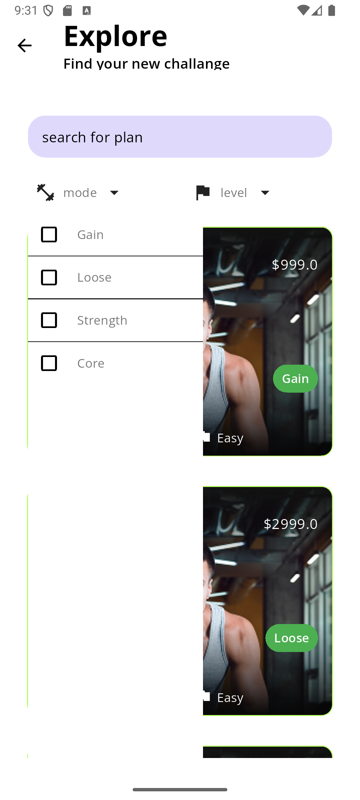
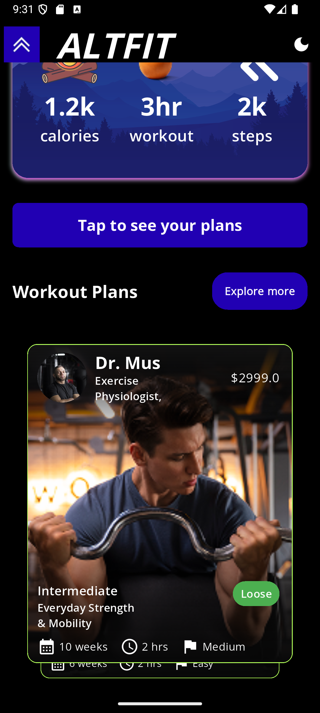

 <h1 style="text-align:center">AltFit</h1>

<h2>Describtion of the app</h2>
<p>Explore diverse workout plans tailored to your fitness goals. Discover routines for all levels. Track progress, view exercise instructions, and stay motivated. Your personalized plans are readily accessible, empowering you to achieve a healthier lifestyle.</p>


<h2>Tech stack used</h2>
 <dl>
   <dt>GetX</dt>
   <dd>State Management using getx</dd>
   <dt>Shared Preferences</dt>
   <dd>For stroing local data like theme and logged in status</dd>
   <dt>Firebase</dt>
   <dd>For backend data storage to retrive the programs and users</dd>
 </dl>

<h2>Screenshots</h2>
<p>



 </p>

<h2>Figma Links</h2>
<href src="https://www.figma.com/design/KW0WRgEpdArgQIhEVuqepl/AltFit?node-id=0-1&t=5oFMQbJT028Nw2vb-1">https://www.figma.com/design/KW0WRgEpdArgQIhEVuqepl/AltFit?node-id=0-1&t=5oFMQbJT028Nw2vb-1</href>


<h2>Flutter Project</h2>
To run this Flutter project, follow these steps:

1.  **Clone the repository:**

    ```bash
    git clone https://github.com/tanay4768/Altfit.git
    ```

2.  **Navigate to the project directory:**

    ```bash
    cd Altfit
    ```

3.  **Get the dependencies:**

    ```bash
    flutter pub get
    ```

4.  **Run the app:**

    *   **On a connected device or emulator:**

        ```bash
        flutter run
        ```

    *   **On a specific device (if multiple devices are connected):**

        ```bash
        flutter run -d <device_id>
        ```
<h2>App Links</h2>
<href src="https://drive.google.com/drive/folders/1VCS_AMe_iefFcYbO3Dh1YimEnE_qUxfx?usp=sharing">https://drive.google.com/drive/folders/1VCS_AMe_iefFcYbO3Dh1YimEnE_qUxfx?usp=sharing</href>
