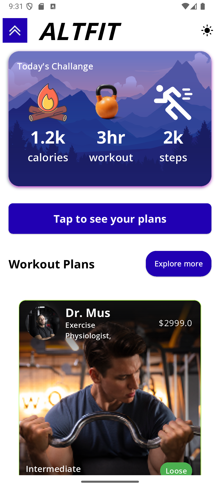
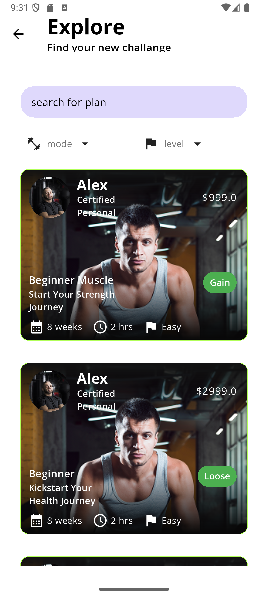

 <h1 style="text-align:center">AltFit</h1>

<h2>Describtion of the app</h2>

Explore diverse workout plans tailored to your fitness goals. Discover routines for all levels. Track progress, view exercise instructions, and stay motivated. Your personalized plans are readily accessible, empowering you to achieve a healthier lifestyle.

<h2>Tech stack used</h2>
 <dl>
   <dt>GetX</dt>
   <dd>State Management using getx</dd>
   <dt>Shared Preferences</dt>
   <dd>For stroing local data like theme and logged in status</dd>
   <dt>Firebase</dt>
   <dd>For backend data storage to retrive the programs and users</dd>
 </dl>

<h2>Screenshots</h2>

